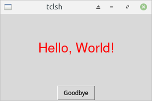
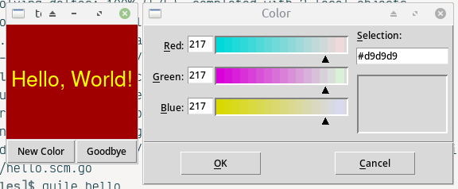
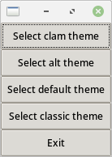
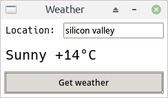

# guile-pstk
PS/TK version (http://mirror.informatimago.com/scheme/www.t3x.org/pstk/index.html) fixed to work fine on modern GNU Guile

### Install
1. Install the "tcl" and "tk" packages through your package manager.
2. Copy pstk.scm to your project and use:
```scheme
(use-modules (pstk))
```

### Examples
| Source | Screenshot |
| --- | --- |
| [hello.scm](./examples/hello.scm) |  |
| [hello-color.scm](./examples/hello-color.scm)  |  |
| [themes.scm](./examples/themes.scm) |  |
| [ttt.scm](./examples/ttt.scm) |  |
| [weather](./examples/weather.scm) |  |

### Tested on
```
GNU Guile 3.0.1
GNU Guile 2.2.7
```
